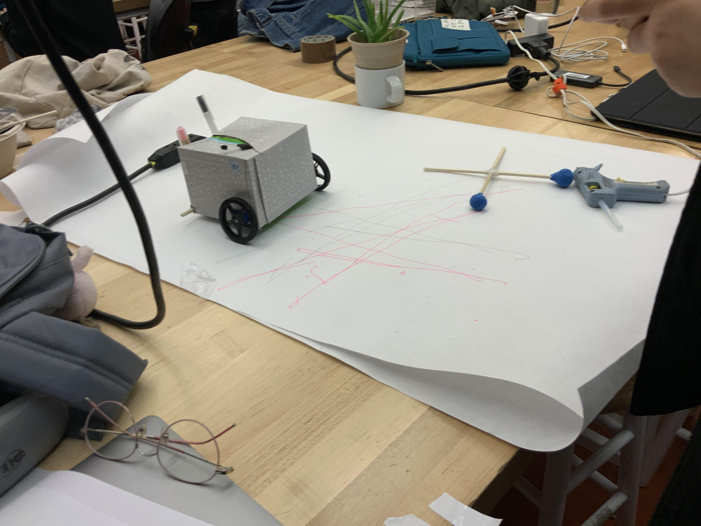

# Arduino_Dual_H-Bridge_Motorsheild_Project

## Overview

The video of the robot moving is in the img dir:

  IMG_0042.MOV

  IMG_0043.MOV

This is a group project for the Computational Practices 1 class at California College of the Arts.

Using various materials, such as a Arduino with an IR Reciever, we were able to have the robot move forward when detecting Infra-Red Light.

The Controller signals using the:

  results.value

When the IR Reciever detects the Infra-Red Light, that value changes.

In a loop it detects that value and moves foward or backward depending on the controller.

    if (irrecv.decode(&results)) {
      Serial.println(results.value);

      if (results.value == 16621663) {
        forward();
        delay(500);
        stop();
      }

      if (results.value == 16625743) {
        backward();
        delay(500);
        stop();
      }

      if (results.value == 16601263) {
        right();
        delay(500);
        stop();
      }

      if (results.value == 16584943) {
        left();
        delay(500);
        stop();
      }
  
      irrecv.resume();    

    }

## Materials

Cardboard chassis

IR Reciever

Arduino

Breadboard

Wheels

Remote

Rubber duck

Mask

## Source Code

	#include <IRremote.h>

	int RECV_PIN = 2;
  IRrecv irrecv(RECV_PIN);
  decode_results results;

  // Motor A
  int IN1 = 7;
  int IN2 = 8;

  // Motor B
  int IN3 = 10;
  int IN4 = 11;

  void stop() {
    // Motor A
    digitalWrite(IN1, LOW);
    digitalWrite(IN2, LOW);

    // Motor B
    digitalWrite(IN3, LOW);
    digitalWrite(IN4, LOW);
  }

  void forward() {
    // Motor A
    digitalWrite(IN1, HIGH);
    digitalWrite(IN2, LOW);

    // Motor B
    digitalWrite(IN3, HIGH);
    digitalWrite(IN4, LOW);
  }

  void backward(){
    //Motor A
    digitalWrite(IN1, LOW);
    digitalWrite(IN2, HIGH);

    // Motor B
    digitalWrite(IN3, LOW);
    digitalWrite(IN4, HIGH);

  }

  void left(){
    //Motor A
    digitalWrite(IN1, LOW);
    digitalWrite(IN2, HIGH);

    // Motor B
    digitalWrite(IN3, HIGH);
    digitalWrite(IN4, LOW);

  }

  void right(){
    //Motor A
    digitalWrite(IN1, HIGH);
    digitalWrite(IN2, LOW);

    // Motor B
    digitalWrite(IN3, LOW);
    digitalWrite(IN4, HIGH);

  }

  void setup() {
    Serial.begin(19200);
    Serial.println("Startup");
    irrecv.enableIRIn();

    Serial.begin(19200);
    pinMode(IN1, OUTPUT);
    pinMode(IN2, OUTPUT);
    pinMode(IN3, OUTPUT);
    pinMode(IN4, OUTPUT);
    stop();
  }

  void loop() {
    if (irrecv.decode(&results)) {
      Serial.println(results.value);

      if (results.value == 16621663) {
        forward();
        delay(500);
        stop();
      }

      if (results.value == 16625743) {
        backward();
        delay(500);
        stop();
      }

      if (results.value == 16601263) {
        right();
        delay(500);
        stop();
      }

      if (results.value == 16584943) {
        left();
        delay(500);
        stop();
      }
  
      irrecv.resume();    

    }
  }
